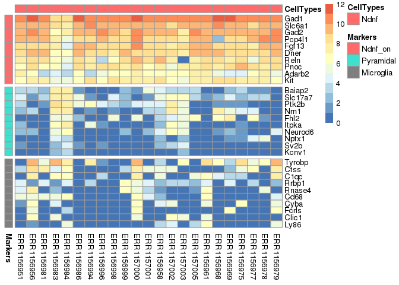
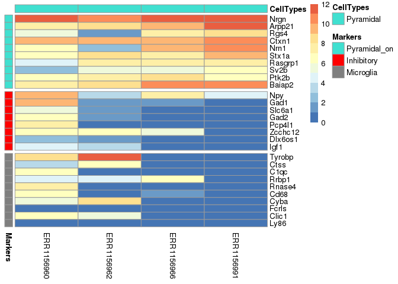
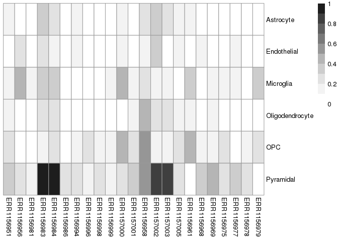
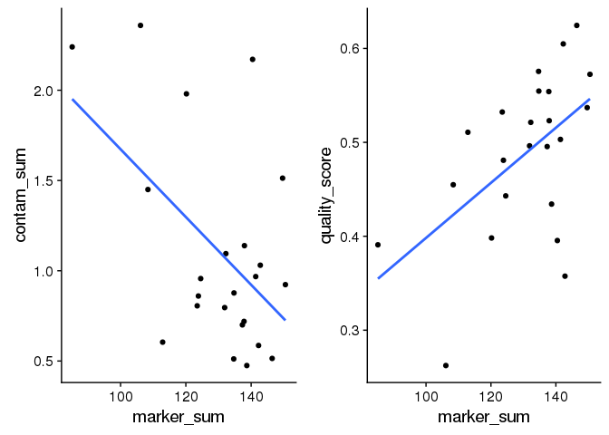

patchSeqQC
==========
This package includes functions for assessing the quality of single-cell transcriptomic data using cell type-specific marker gene expression, based on our paper, [Data-driven approaches for improving the interpretability of patch-seq data](https://www.biorxiv.org/content/early/2018/04/09/298133). All of the code and data for reproducing the figures from the manuscipt is available at the [patchSeqQCManuscript repository](https://github.com/PavlidisLab/patchSeqQCManuscript).

These functions were initially tailored for data collected using the patch-seq methodology, but are applicable to other single-cell RNAseq datasets. This package is meant as a tutorial to illustrate the approach outlined in our paper, but please contact us with feature requests and bug reports.

- [patchSeqQC](#patchseqqc)
- [Installation](#installation)
- [Usage](#usage)
  * [Example patch-seq data](#example-patch-seq-data)
  * [Visualizing cell type-specific marker expression](#visualizing-cell-type-specific-marker-expression)
    + [Cell type specific marker genes](#cell-type-specific-marker-genes)
    + [Associating single-cells to standardized cell type names](#associating-single-cells-to-standardized-cell-type-names)
    + [Visualizing expression of multiple cell type markers](#visualizing-expression-of-multiple-cell-type-markers)
  * [Comparing marker expression in patch-seq data to dissociated cell reference data](#comparing-marker-expression-in-patch-seq-data-to-dissociated-cell-reference-data)
    + [Loading cell dissociation-based single cell reference dataset](#loading-cell-dissociation-based-single-cell-reference-dataset)
    + [Comparing expression of individual marker genes in patch-seq samples to dissociated cells](#comparing-expression-of-individual-marker-genes-in-patch-seq-samples-to-dissociated-cells)
    + [Summarizing cell type specific marker expression in patch-seq data](#summarizing-cell-type-specific-marker-expression-in-patch-seq-data)
    + [Summarizing cell type specific marker expression in reference data](#summarizing-cell-type-specific-marker-expression-in-reference-data)
  * [Computing single-cell quality metrics based on comparison to reference data](#computing-single-cell-quality-metrics-based-on-comparison-to-reference-data)
  * [Caveats in approach](#caveats-in-approach)

Installation
===========
Use devtools to install. Additional github packages needs to be installed for it work.
```
devtools::install_github('PavlidisLab/patchSeqQC')
```

This package requires the following packages:

```
install.packages('ggplot2')
install.packages('pheatmap')
install.packages('dplyr')
install.packages('knitr')
```

Usage
=====

Example patch-seq data
----------------------

This package includes sample data from [Cadwell et al. 2016](https://www.nature.com/articles/nbt.3445), which contains patch-seq data from layer 1 inhibitory interneurons and a small number of pyramidal cells.

```cadwell_meta``` includes basic sample metadata about each single-cell sample

```r
data(cadwell_meta)
knitr::kable(head(cadwell_meta, 3))
```


sample_id    major_type   colors     read_count   ercc_count    ercc_pct
-----------  -----------  --------  -----------  -----------  ----------
ERR1156951   eNGC         #F08080      42149548       383338   0.9094712
ERR1156956   eNGC         #F08080      25616840       634201   2.4757191
ERR1156981   eNGC         #F08080      30085020      1053275   3.5009948

**sample_id:** name of the samples. This needs to correspond to column names in the expression file.

**major_type:** Primary cell type names provided by Cadwell2016

**colors:** Unique color for cell type

**read_count:** Count of number of reads

**ercc_count:** Count of number of reads mapping to ERCC spike-ins

**ercc_pct:** Percent of reads mapping to ERCC spike-ins (relative to all sequenced reads)

```cadwell_expr``` includes gene expression data for these samples (stored as TPM + 1, transcripts per million) 

```r
data(cadwell_expr)
knitr::kable(head(cadwell_expr[, 1:7], 3))
```

         ERR1156951   ERR1156956   ERR1156981   ERR1156983   ERR1156984   ERR1156986   ERR1156994
------  -----------  -----------  -----------  -----------  -----------  -----------  -----------
Gnai3          4.35            1         3.02         1.55         1.13            1            1
Pbsn           1.00            1         1.00         1.00         1.00            1            1
Cdc45          1.00            1         1.00         1.00         1.00            1            1

Visualizing cell type-specific marker expression
-------------------------------

The central idea behind our single-cell quality metrics is that a high-quality single cell should strongly express markers of its own cell type and not express cell-type specific markers of other cell types. For example, we would expect that an cortical inhibitory neuron should strongly express GABAergic markers, like Gad2, Gad1, and not express markers of other cell types, such as markers of microglia like Tyrobp or C1qc. 

### Cell type specific marker genes

To obtain cell type specific markers, we make use of mouse cortex-based single cell reference datasets which are comparable to the cell types profiled by in the Cadwell patch-seq dataset. Here, we provide pre-computed gene markers, ```markers```, based on the [Tasic2016](https://www.nature.com/articles/nn.4216) and [Zeisel2015](http://science.sciencemag.org/content/347/6226/1138.full) reference datasets.

When defining the markers, we have made the distinction between “on” and “off” markers. "On" markers, are genes that are highly expressed in the cell type of interest with enriched expression relative to other cell types. The second class, "Off" markers, are expected to be expressed at low levels in a given patch-seq cell type. These are genes that are specifically expressed in a single cell type (e.g., microglia) and, if expressed, are an indicator of possible cellular contamination.


```r
data(markers)
lapply(markers,head, 5)
```

```
## $Astrocyte
## [1] "Gstm1"  "F3"     "Appl2"  "Fxyd1"  "Slc1a3"
## 
## $Endothelial
## [1] "Crip1"    "Tpm4"     "Arhgap29" "Igfbp7"   "S100a11" 
## 
## $Microglia
## [1] "Tyrobp" "Ctss"   "C1qc"   "Rrbp1"  "Rnase4"
## 
## $Oligodendrocyte
## [1] "Desi1" "Mobp"  "Eml1"  "Grb14" "Pllp" 
## 
## $OPC
## [1] "Fosb"   "Cdo1"   "Gpt2"   "Vcan"   "Rnf180"
## 
## $Pyramidal
## [1] "Baiap2"  "Slc17a7" "Ptk2b"   "Nrn1"    "Fhl2"   
## 
## $Inhibitory
## [1] "Npy"    "Gad1"   "Slc6a1" "Gad2"   "Pcp4l1"
## 
## $Ndnf_on
## [1] "Gad1"   "Slc6a1" "Gad2"   "Pcp4l1" "Fgf13" 
## 
## $Sncg_on
## [1] "Cnr1"    "Gad1"    "Sncg"    "Synpr"   "Zcchc12"
## 
## $Pvalb_on
## [1] "Gad1"   "Slc6a1" "Gad2"   "Pvalb"  "Nxph1" 
## 
## $Pyramidal_on
## [1] "Nrgn"   "Arpp21" "Rgs4"   "Ctxn1"  "Nrn1"
```
### Associating single-cells to standardized cell type names
To make use of these marker genes, we need to associate each single cell from the patch-seq dataset to one of the "On" marker types listed above. Here, we define a column `contam_type` in the `cadwell_meta` data frame and assign all of the interneurons from the Cadwell dataset to the cell type "Ndnf", and the excitatory cells to the "Pyramidal" type.


```r
cadwell_meta$contam_type = 'Ndnf'
cadwell_meta[str_detect(cadwell_meta$major_type, 'Exc'), 'contam_type'] = 'Pyramidal'

knitr::kable(head(cadwell_meta %>% dplyr::select(sample_id, major_type, contam_type)))
```


sample_id    major_type   contam_type 
-----------  -----------  ------------
ERR1156951   eNGC         Ndnf        
ERR1156956   eNGC         Ndnf        
ERR1156981   eNGC         Ndnf        
ERR1156983   eNGC         Ndnf        
ERR1156984   eNGC         Ndnf        
ERR1156986   eNGC         Ndnf        

### Visualizing expression of multiple cell type markers

Below, we use the function ```plotMarkerHeatmap``` to plot the expression of cell type specific markers of the elongated neurogliaform cells (eNGC) and pyramidal cells from the cadwell dataset. We also define the gene expression data frame, ```cadwell_engc_df```, which stores both metadata and gene expression values for the eNGC cells. 


```r
# plot marker expression of cadwell eNGCs

cadwell_engc_samples = cadwell_meta %>% 
  dplyr::filter(major_type == 'eNGC') %>% 
  dplyr::pull(sample_id)  # get sample ids for eNGC cells

cadwell_engc_df = cadwell_expr[, cadwell_engc_samples]

cadwell_engc_df = cbind(cadwell_meta[cadwell_meta$sample_id %in% cadwell_engc_samples, ], 
                        cadwell_engc_df  %>% t()) # combines metadata and expression matrices and transposes it
rownames(cadwell_engc_df) = cadwell_engc_samples

plot_cell_types = c('Ndnf_on', 'Pyramidal', 'Microglia') # define which cell types to plot in heatmap
plot_marker_list = c(markers[plot_cell_types])

cadwell_engc_heatmap = plotMarkerHeatmap(markerlist = plot_marker_list, # named list of lists defining which markers to show
                                         expr_matrix = cadwell_engc_df, # data frame that combines gene expr with metadata, each row is a single-cell
                                         show_legend = T, # show color bar ?
                                         show_cell_labels = T # show sample names in heatmap (defined by rownames of expr_matrix)
                                         )
```

<!-- -->

```r
# plot expression of cadwell pyramidal cells

cadwell_pyr_samples = cadwell_meta %>% dplyr::filter(major_type == 'Exc') %>% dplyr::pull(sample_id) 
cadwell_pyr_df = cadwell_expr[, cadwell_pyr_samples]

cadwell_pyr_df = cbind(cadwell_meta[cadwell_meta$sample_id %in% cadwell_pyr_samples, ], cadwell_pyr_df  %>% t())
rownames(cadwell_pyr_df) = cadwell_pyr_samples

plot_cell_types = c('Pyramidal_on', 'Inhibitory', 'Microglia')
plot_marker_list = c(markers[plot_cell_types])

cadwell_pyramidal_heatmap = plotMarkerHeatmap(plot_marker_list, cadwell_pyr_df, show_legend = T, show_cell_labels = T )
```

<!-- -->

Comparing marker expression in patch-seq data to dissociated cell reference data
--------------------------------------

### Loading cell dissociation-based single cell reference dataset 

We've provided a small version of the Tasic2016 single cell cortical reference dataset (with expression of only marker genes), stored in the variable ```aibsExprData``` and quantified as TPM + 1. Metadata for these samples is available in ```aibsExprData```. 


```r
data(aibsExprData) # need to show that we have a field major types and contam_Type in here as well
knitr::kable(head(aibsExprData[1:5, 1:5]))
```

          GSM1839240   GSM1839242   GSM1839239   GSM1839244   GSM1839241
-------  -----------  -----------  -----------  -----------  -----------
Gstm1           1.00         1.00      3788.38      6690.01      2016.17
F3              1.00         1.00      1465.79      1599.76      1436.23
Appl2           1.00         2.21      1493.16       329.18        24.83
Fxyd1           1.00         8.10         1.00       250.00        45.87
Slc1a3          1.09         1.17      6329.91      4443.95      2992.33

```r
data(aibsExprMeta) 
knitr::kable(head(aibsExprMeta, 4))
```


sample_id    aibs_type    norm_sub_types   norm_broad_types    read_count   ercc_count    ercc_pct  colors  
-----------  -----------  ---------------  -----------------  -----------  -----------  ----------  --------
GSM1839240   Vip Chat     Inhibitory       Inhibitory             4101528       139267   0.0339549  magenta 
GSM1839242   L2/3 Ptgs2   Pyramidal        Pyramidal              4393012       104339   0.0237511  magenta 
GSM1839239   Astro Gja1   Astrocyte        Astrocyte              3457441       348669   0.1008460  magenta 
GSM1839244   Astro Gja1   Astrocyte        Astrocyte              3915440       473689   0.1209798  magenta 

```r
aibsExprDataDf = cbind(aibsExprMeta, aibsExprData  %>% t()) # combines metadata and expression matrices 
rownames(aibsExprDataDf) = aibsExprMeta$sample_id
```
**sample_id:** name of the samples. This needs to correspond to column names in the expression file.

**aibs_type:** Primary cell type names provided in Tasic2016

**norm_sub_types: ** Cell type subtype names

**norm_broad_types: ** Cell type broad names

### Comparing expression of individual marker genes in patch-seq samples to dissociated cells
After loading in the data from the Tasic2016 data, we can compare at the expression of cell type specific markers (for various cell types) to the same markers in patch-seq samples, Below, we use the function `plotPatchSeqVsDissocMarkerExpr` for this purpose, which on the y-axis shows the average expression of markers across `Ndnf` cells in the Tasic 2016 data and the x-axis shows expression of markers in a single patch-seq sample (one marker gene = one dot). 


```r
cell_types_to_plot = c('Ndnf_on', 'Astrocyte', 'Endothelial', 'Microglia', 'Oligodendrocyte', 'OPC', 'Pyramidal')

plotPatchSeqVsDissocMarkerExpr(patch_seq_df = cadwell_engc_df, # patch-seq data frame that combines gene expr with metadata, each row is a single-cell
                                dissoc_cell_df = aibsExprDataDf, # dissociated cell data frame that combines gene expr with metadata, each row is a single-cell
                                contam_type = 'Ndnf', # cell type to plot
                                plot_cell_sample_ids = c('ERR1156978', 'ERR1156984'), # sample_ids to show
                                plot_marker_types = cell_types_to_plot, # cell types to show markers for
                                markers = markers # named list of lists for marker genes
                               ) 
```

<!-- -->

### Summarizing cell type specific marker expression in patch-seq data
For each cell in the patch-seq dataset, we'll use the cell type specific marker genes to calculate summaries of each cell type's marker expression using the function ```calcContamAllTypes```. Each column is named a major cell type (i.e., a major cell type with defined markers in `markers`) and stores the sum of each cell's expression of each cell type marker (in units log2 (TPM + 1)).


```r
cadwell_contam = calcContamAllTypes(cadwell_engc_df, markers) 
cadwell_contam$colors = "indianred1"
cadwell_contam$major_type = cadwell_engc_df$major_type
cadwell_contam$contam_type = "Ndnf_on"

knitr::kable(head(cadwell_contam[1:8], 3))
```

              Astrocyte   Endothelial   Microglia   Oligodendrocyte         OPC   Pyramidal   Inhibitory    Ndnf_on
-----------  ----------  ------------  ----------  ----------------  ----------  ----------  -----------  ---------
ERR1156951     39.78814      5.392378    24.84645          41.51675   20.316027   20.115628     72.68619   132.2617
ERR1156956     14.04896     12.864828    65.34141          22.77214   10.900621   13.685440     73.92142   142.8065
ERR1156981     14.68443      4.939211    25.67249          11.63907    9.631161    9.782124     68.38971   138.6779

### Summarizing cell type specific marker expression in reference data
We'll use the same function ```calcContamAllTypes``` to calculate summarized marker expression for each cell in the dissociated cell based Tasic2016 reference data, stored in the variable ```aibsExprDataDf```. Please note that it's essential that both the patch-seq data and the reference data are normalized using the same metric, TPM + 1 (transcripts per million) here.


```r
aibs_ndnf_contam = calcContamAllTypes(aibsExprDataDf[str_detect(aibsExprDataDf$aibs_type, 'Ndnf'), ], markers) 
aibs_ndnf_contam$colors = 'indianred1'
aibs_ndnf_contam$contam_type = 'Ndnf_on'

aibs_pyr_contam = calcContamAllTypes(aibsExprDataDf[str_detect(aibsExprDataDf$aibs_type, 'L'), ], markers) 
aibs_pyr_contam$colors = "turquoise"
aibs_pyr_contam$contam_type = 'Pyramidal'

aibs_contam = rbind(aibs_ndnf_contam %>% dplyr::select(Ndnf_on, Pyramidal, colors, contam_type), 
                    aibs_pyr_contam %>% dplyr::select(Ndnf_on, Pyramidal, colors, contam_type)
)
```

We can use the function ```plotPatchSeqDissocCellMarkerExpr``` to plot the summarized marker expression for both the patch-seq and the reference datasets (one dot = one cell). 


```r
plotPatchSeqDissocCellMarkerExpr(patch_seq_contam_df = cadwell_contam,
                                  dissoc_cell_contam_df = aibs_contam, 
                                 on_type = 'Ndnf_on', 
                                 off_type = 'Pyramidal')
```

<!-- -->

Move this somewhere else


```r
aibsExprDataDf$contam_type = aibsExprDataDf$norm_broad_type
aibs_contam_all_broad = calcContamAllTypes(aibsExprDataDf, markers)
aibs_contam_all_broad$contam_type = factor(aibsExprDataDf$contam_type)
aibs_med_exprs_broad = aibs_contam_all_broad %>% dplyr::group_by(contam_type) %>% dplyr::summarize_all(median) %>% as.data.frame()
rownames(aibs_med_exprs_broad) = aibs_med_exprs_broad$contam_type

aibsExprDataDf$contam_type = paste0(aibsExprDataDf$norm_sub_type, '_on')
aibs_contam_all_sub = calcContamAllTypes(aibsExprDataDf, markers)
aibs_contam_all_sub$contam_type = factor(aibsExprDataDf$contam_type)
aibs_med_exprs_sub = aibs_contam_all_sub %>% dplyr::group_by(contam_type) %>% dplyr::summarize_all(median) %>% as.data.frame()
rownames(aibs_med_exprs_sub) = aibs_med_exprs_sub$contam_type

aibs_med_exprs = rbind(aibs_med_exprs_broad, aibs_med_exprs_sub[c('Ndnf_on', 'Sncg_on', 'Pvalb_on', 'Pyramidal_on'), ])

compare_cell_types_inh = setdiff(names(markers), c('Ndnf_on', 'Pvalb_on', 'Sncg_on', 'Pyramidal_on', 'Inhibitory')) %>% make.names()
compare_cell_types_exc = setdiff(names(markers), c('Pyramidal_on', 'Pvalb_on', 'Sncg_on', 'Ndnf_on', 'Pyramidal')) %>% make.names()

exc_cell_types = c('CA1-PYR', 'Exc', 'RS-PYR', 'BS-PYR')
```

Computing single-cell quality metrics based on comparison to reference data
---------------------------------------------------------------------------

We have developed a number of metrics to evaluate the quality of single cell samples by comparison to dissociated cell reference data that can be calculated using the function ```calculatePatchSeqQCMetrics```.

```r
cadwell_engc_qc_df = calculatePatchSeqQCMetrics(cadwell_engc_df, comparison_dataset = 'aibs', markers)

knitr::kable(head(cadwell_engc_qc_df %>% dplyr::select(sample_id:quality_score)))
```

     sample_id    major_type   contam_type    marker_sum   marker_sum_norm   contam_sum   quality_score
---  -----------  -----------  ------------  -----------  ----------------  -----------  --------------
1    ERR1156951   eNGC         Ndnf            132.26171         0.8447999    1.0949213       0.5212651
2    ERR1156956   eNGC         Ndnf            142.80646         0.9121527    1.0306555       0.3574985
11   ERR1156981   eNGC         Ndnf            138.67790         0.8857822    0.4750284       0.4342528
12   ERR1156983   eNGC         Ndnf            106.10947         0.6777567    2.3589052       0.2623394
13   ERR1156984   eNGC         Ndnf             85.17883         0.5440657    2.2399839       0.3908998
14   ERR1156986   eNGC         Ndnf            146.43814         0.9353495    0.5143846       0.6244818

**sample_id:** name of the samples. 

**major_type:** cell type identities (provided by Cadwell2016)

**contam_type:** cell type identities (normalized to cell type names in `markers`)

**marker_sum:** Summed expression of "On" cell type marker genes (with cell type defined by `contam_type`)

**marker_sum_norm:** Normalized summed expression of "on"-type marker genes, normalized to median expression of same cell type in dissociated-cell reference data

**contam_sum:** Contamination score, defined as the sum of normalized expression across all "off" cell types defined in `compare_cell_types_inh`

**quality_score:** Quality score, defined as the Spearman correlation of marker expression between markers expressed in single cell with mean expression of markers in dissociated cell reference data


This function also outputs normalized expression of each "off"-cell type (defined in `compare_cell_types_inh`) and we can use the function `plotContamHeatmap` to show these (each column is one single cell)

```r
knitr::kable(head(cadwell_engc_qc_df %>% dplyr::select(sample_id, Astrocyte:Pyramidal)))
```

     sample_id     Astrocyte   Endothelial   Microglia   Oligodendrocyte         OPC   Pyramidal
---  -----------  ----------  ------------  ----------  ----------------  ----------  ----------
1    ERR1156951    0.1088640     0.0941299   0.1505082         0.1658869   0.2308079   0.3447244
2    ERR1156956    0.0050728     0.2327905   0.4197299         0.0677605   0.0721286   0.2331731
11   ERR1156981    0.0076353     0.0857208   0.1560000         0.0094799   0.0507342   0.1654582
12   ERR1156983    0.3854968     0.2725112   0.3288887         0.2238120   0.1345609   1.0136356
13   ERR1156984    0.2424618     0.1834264   0.3076201         0.2217693   0.2237593   1.0609470
14   ERR1156986    0.0427454     0.0167817   0.0475493         0.0363846   0.0757241   0.2951996

```r
contam_plot_types = factor(c('Astrocyte', 'Endothelial', 'Microglia', 'Oligodendrocyte', 'OPC', 'Pyramidal'), levels = c('Astrocyte', 'Endothelial', 'Microglia', 'Oligodendrocyte', 'OPC', 'Pyramidal'))
contam_mat = getContamMatrixFromPatchSeq(cadwell_engc_qc_df, 'eNGC', contam_show_types = contam_plot_types)
summarized_contam_heatmap = plotContamHeatmap(contam_mat, show_cell_labels = T)
```

<!-- -->

We plot the `marker_sum`, `contam_sum` and `quality_score` variables below

```r
p1 = ggplot2::ggplot(data = cadwell_engc_qc_df, aes(x = marker_sum, y = contam_sum)) + 
  geom_point() + geom_smooth(method = "lm", se = F)
p2 = ggplot2::ggplot(data = cadwell_engc_qc_df, aes(x = marker_sum, y = quality_score)) + 
  geom_point() + geom_smooth(method = "lm", se = F)

plot_grid(p1, p2, nrow = 1)
```

<!-- -->

Caveats in approach
-------------------
Our single-cell quality metrics are dependent on the following factors: 1) being able to confidently assign a single-cell's major cell type, ideally without using its transcriptomic data. 2) the availability of high-quality single-cell reference data to use for comparing the expression of observed marker genes to expected marker genes. 

We note that there are likely situations where either or both of these do not hold, for example, if the cells profiled have unknown types or if reference data is not available (for example, patch-seq data collected from a brain region without adequate cell-dissociation based single-cell atlases).
